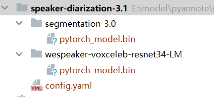
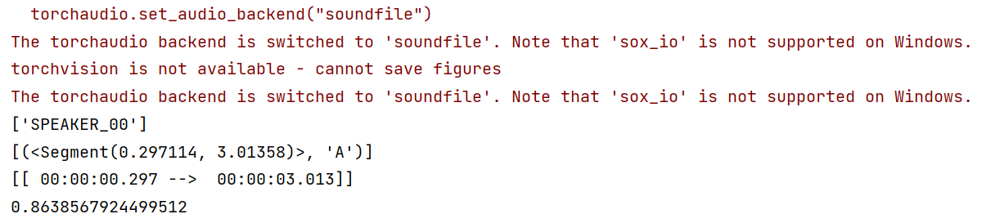

# 使用pyannote-audio实现声纹分割聚类


# 1 简单介绍

pyannote.audio是用Python编写的用于声纹分割聚类的开源工具包。在PyTorch机器学习基础上，不仅可以借助性能优越的预训练模型和管道实现声纹分割聚类，还可以进一步微调模型。

它的主要功能有以下几个：

1. 声纹嵌入：从一段声音中提出声纹转换为向量（嵌入）；
2. 声纹识别：从一段声音中识别不同的人（多个人）；
3. 声纹活动检测：检测一段声音检测不同时间点的活动；
4. 声纹重叠检测：检测一段声音中重叠交叉的部分；
5. 声纹分割；将一段声音进行分割；

pyannote.audio中主要有”segmentation“、”embedding“和”speaker-diarization“三个模型，”segmentation“的主要作用是分割、”embedding“主要作用是嵌入（跟wespeaker-voxceleb-resnet34-LM作用相同），”speaker-diarization“的作用是使用管道对上面两个模型整合。

pyannote-audio的参考地址

```
# Huggingface地址
https://hf-mirror.com/pyannote

# Github地址
https://github.com/pyannote/pyannote-audio
```


:warning: 注意： pyannote.audio不同的版本有些区别；


# 2 使用pyannote.audio:3.1.3


## 2.1 安装pyannote.audio

```
pip install pyannote.audio==3.1.1 -i https://pypi.tuna.tsinghua.edu.cn/simple
```

使用模型需要现在huggingface上下载模型，模型如下：

:warning: pyannote.audio的部分模型是收到保护的，即需要在huggingface登录后，填写部分信息，同意相关协议才能下载，否则无法下载。

```
# 1 嵌入模型 pyannote/wespeaker-voxceleb-resnet34-LM 
https://hf-mirror.com/pyannote/wespeaker-voxceleb-resnet34-LM

# 2 分割模型 pyannote/segmentation-3.0
https://hf-mirror.com/pyannote/segmentation-3.0
```


使用huggingface-cli下载相关模型的命令：

```
# 注意：需要先创建Python环境

# 安装huggingface-cli
pip install -U huggingface_hub

# 例如下载pyannote/embedding模型
# 必须提供Hugging上的 --token hf_****
huggingface-cli download --resume-download pyannote/embedding --local-dir pyannote/embedding --local-dir-use-symlinks False --token hf_****
```

注意两个类

```
# Inference主要用于声纹嵌入
pyannote.audio import Inference

# Annotation主要用于声纹分割
from pyannote.core import Annotation

# Annotation中的主要方法，假设实例为；diarization
# 获取声音中说话人的标识
labels = diarization.labels()

# 获取声音中全部的活动Segment（列表）
segments = list(diarization.itertracks())

# 获取声音中指定说话人时间段（列表），”SPEAKER_00“为第一个说话人的标识
durations = diarization.label_timeline('SPEAKER_00')
```


## 2.2 实现声纹分割

注意：pyannote/speaker-diarization-3.1实现声纹识别特别慢，不知道是不是我的方法不对（30分钟的音频，处理了20多分钟）。:warning: 使用单个模型很快。pyannote/speaker-diarization（版本2）较快，推荐使用pyannote/speaker-diarization（版本2）。

注意：此处加载模型和通常加载模型的思路不同，常规加载模型直接到名称即可，此处需要加载到具体的模型名称。

**（1）使用python方法**

```python
# 使用 pyannote-audio-3.1.1
import time

from pyannote.audio import Model
from pyannote.audio.pipelines import SpeakerDiarization
from pyannote.audio.pipelines.utils import PipelineModel
from pyannote.core import Annotation

# 语音转向量模型
embedding: PipelineModel = Model.from_pretrained("E:/model/pyannote/pyannote-audio-3.1.1/wespeaker-voxceleb-resnet34-LM/pytorch_model.bin")
# 分割语音模型
segmentation: PipelineModel = Model.from_pretrained("E:/model/pyannote/pyannote-audio-3.1.1/segmentation-3.0/pytorch_model.bin")

# 语音分离模型
speaker_diarization: SpeakerDiarization = SpeakerDiarization(segmentation=segmentation, embedding=embedding)

# 初始化语音分离模型的参数
HYPER_PARAMETERS = {
    "clustering": {
        "method": "centroid",
        "min_cluster_size": 12,
        "threshold": 0.7045654963945799
    },
    "segmentation":{
        "min_duration_off": 0.58
    }
}
speaker_diarization.instantiate(HYPER_PARAMETERS)

start_time = time.time()

# 分离语音
diarization: Annotation = speaker_diarization("E:/语音识别/数据/0-test-en.wav")

# 获取说话人列表
print(diarization.labels())
# 获取活动segments列表
print(list(diarization.itertracks()))
print(diarization.label_timeline('SPEAKER_00'))

ent_time = time.time()
print(ent_time - start_time)
```


**（2）使用yml方法**

```python
# instantiate the pipeline
from pyannote.audio import Pipeline
from pyannote.core import Annotation

speaker_diarization = Pipeline.from_pretrained("E:/model/pyannote/speaker-diarization-3.1/config.yaml")

# 分离语音
diarization: Annotation = speaker_diarization("E:/语音识别/数据/0-test-en.wav")

print(type(diarization))
print(diarization.labels())
```


**config.yaml**

根据文件可以看出，声纹分割是将embedding和segmentation进行了组合。

```yaml
version: 3.1.0

pipeline:
  name: pyannote.audio.pipelines.SpeakerDiarization
  params:
    clustering: AgglomerativeClustering
    # embedding: pyannote/wespeaker-voxceleb-resnet34-LM
    embedding: E:/model/pyannote/speaker-diarization-3.1/wespeaker-voxceleb-resnet34-LM/pytorch_model.bin
    embedding_batch_size: 32
    embedding_exclude_overlap: true
    # segmentation: pyannote/segmentation-3.0
    segmentation: E:/model/pyannote/speaker-diarization-3.1/segmentation-3.0/pytorch_model.bin
    segmentation_batch_size: 32

params:
  clustering:
    method: centroid
    min_cluster_size: 12
    threshold: 0.7045654963945799
  segmentation:
    min_duration_off: 0.0
```


**模型目录**

模型中的其他文件可以删除，只保留”pytorch_model.bin“即可。




### 执行结果




## 2.3 实现声纹识别

比较两段声音的相似度。

```python
from pyannote.audio import Model
from pyannote.audio import Inference
from scipy.spatial.distance import cdist

# 导入模型
embedding = Model.from_pretrained("E:/model/pyannote/speaker-diarization-3.1/wespeaker-voxceleb-resnet34-LM/pytorch_model.bin")

# 抽取声纹
inference: Inference = Inference(embedding, window="whole")

# 生成声纹，1维向量
embedding1 = inference("E:/语音识别/数据/0-test-en.wav")
embedding2 = inference("E:/语音识别/数据/0-test-en.wav")

# 计算两个声纹的相似度
distance = cdist([embedding1], [embedding2], metric="cosine")
print(distance)
```


## 2.4 检测声纹活动

```python

from pyannote.audio import Model
from pyannote.core import Annotation
from pyannote.audio.pipelines import VoiceActivityDetection

# 加载模型
model = Model.from_pretrained("E:/model/pyannote/speaker-diarization-3.1/segmentation-3.0/pytorch_model.bin")

# 初始化参数
activity_detection = VoiceActivityDetection(segmentation=model)
HYPER_PARAMETERS = {
  # remove speech regions shorter than that many seconds.
  "min_duration_on": 1,
  # fill non-speech regions shorter than that many seconds.
  "min_duration_off": 0
}
activity_detection.instantiate(HYPER_PARAMETERS)

# 获取活动特征
annotation: Annotation = activity_detection("E:/语音识别/数据/0-test-en.wav")

# 获取活动列表
segments = list(annotation.itertracks())
print(segments)
```


# 3 使用pyannote.audio:2.1.1


## 3.1 安装pyannote.audio

```
# 安装包
pip install pyannote.audio==2.1.1 -i https://pypi.tuna.tsinghua.edu.cn/simple

# 1 嵌入模型 pyannote/embedding
https://hf-mirror.com/pyannote/embedding

# 2 分割模型 pyannote/segmentation
https://hf-mirror.com/pyannote/segmentation
```


## 3.2 实现声纹分割

```python
# 使用 pyannote-audio-2.1.1
import time

from pyannote.audio.pipelines import SpeakerDiarization
from pyannote.audio import Model
from pyannote.audio.pipelines.utils import PipelineModel
from pyannote.core import Annotation

# 语音转向量模型
embedding: PipelineModel = Model.from_pretrained("E:/model/pyannote/pyannote-audio-2.1.1/embedding/pytorch_model.bin")

# 分割语音模型
segmentation: PipelineModel = Model.from_pretrained("E:/model/pyannote/pyannote-audio-2.1.1/segmentation/pytorch_model.bin")

# 语音分离模型
speaker_diarization: SpeakerDiarization = SpeakerDiarization(
    segmentation=segmentation,
    embedding=embedding,
    clustering="AgglomerativeClustering"
)

HYPER_PARAMETERS = {
    "clustering": {
        "method": "centroid",
        "min_cluster_size": 15,
        "threshold": 0.7153814381597874
    },
    "segmentation":{
        "min_duration_off": 0.5817029604921046,
        "threshold": 0.4442333667381752
    }
}

speaker_diarization.instantiate(HYPER_PARAMETERS)

start_time = time.time()
# vad: Annotation = pipeline("E:/语音识别/数据/0-test-en.wav")
diarization: Annotation = speaker_diarization("E:/语音识别/数据/0-test-en.wav")

# 获取说话人列表
print(diarization.labels())

ent_time = time.time()
print(ent_time - start_time)
```


## 3.3 其他功能

3.1.1版本的功能2.1.1都能实现，参考3.1.1版本即可。